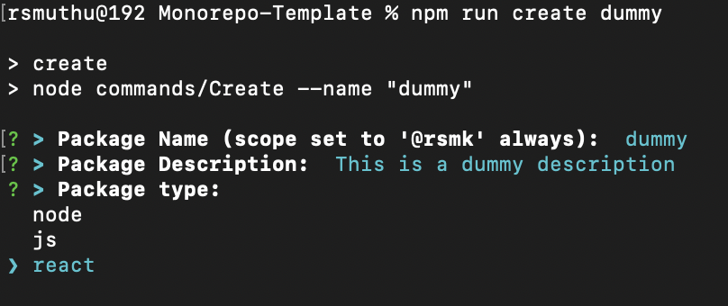
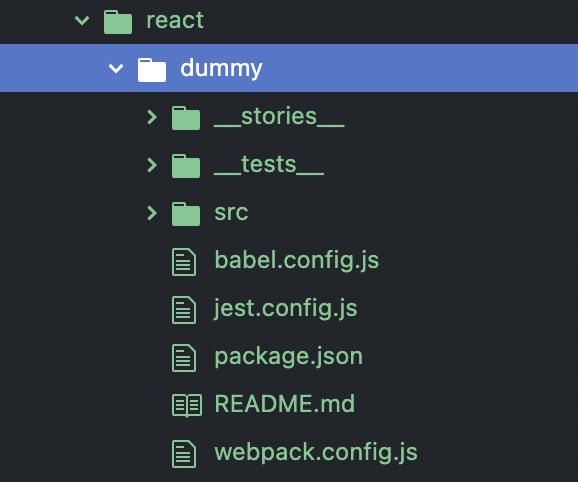

# Monorepo Template
This is a monorepo template which holds library components built off react, plain js or nodejs.\
This is more of an accumulation of my few learning in past few weeks.\
All the common and dev dependencies are pulled out to the rootdir of monorepo to leverage those dependencies from the packages while few majors (like, react & react-dom) are set as peer-dependencies.\
Most necesary scripts have also been added along with the monorepo template to facilitate ci/cd workflows.
React peer dependencies are set to v17.0.2 and not the latest v18 as it would more amendment to my base template

Recommended Node version: v16.11+ (for es13 specification features)

#### Package Creation
Showing the images for react package creation alone. The other types of packages can be created in similar way.

#### Features available in this template
- [lerna](https://lerna.js.org/) setup for monorepo & workspace management
- lerna task execution via [nx](https://nx.dev/) (for effective lerna task execution)
- [Babel](https://babeljs.io/) setup (for ecmascript)
- Linters ([eslint](https://eslint.org/) & [stylelint](https://stylelint.io/) - standard configs and few of my personal likings)
- unit testing [Jest](https://jestjs.io/) (setup on both package level and repo level)
- code coverage + threshold validation via [nyc](https://istanbul.js.org/) & [Jest](https://jestjs.io/)
- [Storybook](https://storybook.js.org/) for UI components (along with feature for attaching [figma](https://www.figma.com/) or adobe design)
- Custom package creation command for this monorepo template.
- [Webpack5](https://webpack.js.org/) bundler made to handle different scenarios of packages
- [semver](https://semver.org/) versioning through version bump based on commit message
- commit message enforced via [commitlint](https://commitlint.js.org/) to conventional commit standards
- Git hooks setup via [husky](https://typicode.github.io/husky/) (pre-commit & commit-msg)
- Basic Proxy registry (along with uplink) setup with [verdaccio](https://verdaccio.org/)

#### Future plans
- Update react to latest v18 for its latest features
- add Vuejs compatibility to this monorepo template
- add a custom storybook framework for supporting both vuejs & reactjs together on storybook bundling
- add clean github workflows to the monorepo template
